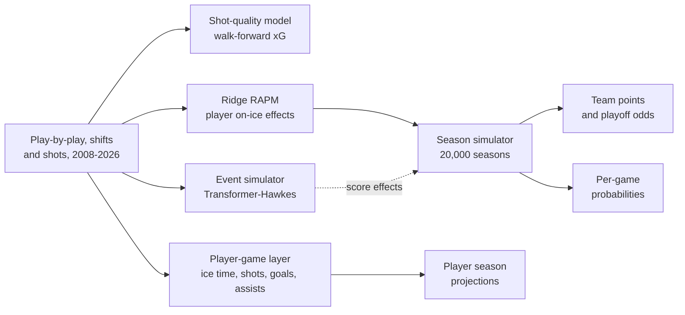

# NeurHL

**NeurHL 1.0** projects the 2026-27 NHL season from the puck up: every
regular-season game, every team's points and playoff odds, and goals, assists
and points for 711 skaters. The predictions were frozen before opening night
and are scored in public as the season is played.

**Browse the projections: [ph05.github.io/neurhl](https://ph05.github.io/neurhl/)**

NeurHL was built under preregistration. Every model, gate and decision rule
was committed before the numbers that tested it existed, and the final tests
ran once on seasons no decision had touched. The record of what worked and
what did not is kept as carefully as the model. [EVIDENCE.md](EVIDENCE.md)
lists every claim with the strength of the evidence behind it.

## Findings

- **Player games: confirmed.** A chained gradient-boosted model of ice time,
  shots, goals and assists beats each skater's own recent average on all four
  targets. It was frozen after development and scored once on 2017-18 through
  2019-20 (130,092 skater-games). Gains range from 2.6% to 10.2%, and the
  model wins in every season.
- **Game outcomes: see [EVIDENCE.md](EVIDENCE.md#confirmed).** NeurHL-H, a
  neural player layer feeding a small logistic head, beat Elo on the tune
  window (log loss -0.0028, p = 0.0075). That estimate is exploratory. The
  one-shot test on 2017-18 through 2025-26 (10,184 games) decides it.
- **Neural representations of hockey events: a documented null.** A
  transformer trained on 7.6 million play-by-play events learns what kind of
  player someone is (position is linearly decodable at 95%). Pooled over a
  roster, it says almost nothing about how good a team is. Every attempt to
  beat Elo from those embeddings finished level with a constant home-win rate.
- **Season standings: level with Elo, not better.** The season simulator's
  80% intervals are calibrated (0.794 coverage). On matched backtest seasons
  its points error is slightly worse than the Elo baseline's (9.99 vs 9.17,
  not significant).

## How it works



| Component | What it does | Status |
|---|---|---|
| Shot-quality (xG) model | Gradient-boosted goal probability per shot, refit each season on prior seasons only | Beats distance-and-angle in 18/18 seasons; top-decile calibration misses its 0.005 target |
| RAPM | Stint-level ridge regression of on-ice shot rates, with team-season fixed effects | Used for roster strength; not shown better than team-demeaned raw rates |
| Event simulator | 5.3M-parameter marked point process over the event stream, 5-seed ensemble | Reproduces per-period event rates and score effects; audited for leakage |
| Player-game layer | Chained models for opportunity, volume and conversion, using usage, absences and opponent context | Confirmed on 2017-18 to 2019-20 |
| Season simulator | Team scoring rates, roster RAPM and score effects, integrated per game; team strength drawn once per simulated season | Calibrated intervals; level with Elo on points error |
| Player season projection | 50/50 blend of a gradient-boosted season model and the player-game layer summed over the schedule | Best of three in backtest (9.07 points per 82 games) |
| NeurHL-H | Neural player layer aggregated to team shot share, combined with Elo in a thin logistic head | Exploratory win over Elo; one-shot test decides |

## How it was tested

Seasons were assigned to roles before any model was fitted, and the scoring
code refuses to cross those lines.

| Window | Seasons (year ending) | Use |
|---|---|---|
| Development | 2009-2011 | Architecture and calibration choices |
| Tune | 2012-2017 | Gates and model selection |
| Confirmation | 2018-2026 | Scored once per layer, after a freeze commit |
| Live | 2027 | Predictions frozen 2026-09-25, scored as played |

The 2013 season (lockout: 48 games, conference-only) and the 2021 season
(56 games, division-only) are used for training but never for scoring. Every
quantity used to predict a season comes from earlier seasons only, and every
search over configurations was capped and logged in
`neurhl/configs/search_ledger*.csv`.

The preregistration documents are the primary record:
[PLAN_NeurHL.md](PLAN_NeurHL.md) (neural hierarchy and NeurHL-H),
[PLAN_NeurHL2.md](PLAN_NeurHL2.md) (event simulator and season layer),
[PLAN_NeurHL3.md](PLAN_NeurHL3.md) (player and goalie layers) and
[PLAN_NeurHL_LIVE.md](PLAN_NeurHL_LIVE.md) (live scoring). Each amendment is
dated and committed before the run it governs.

## Outputs

| File | Contents |
|---|---|
| `neurhl/output/games_2027.csv` | Home-win probability for all 1,344 games, with a preseason Elo reference |
| `neurhl/output/projection_2027.csv` | Team points (mean, 10th and 90th percentile), wins and playoff probability |
| `neurhl/output/player_proj_2027.csv` | Skater games, ice time, goals, assists and points |
| `neurhl/output/live/scorecard_2027.json` | Running live scorecard |

## Reproducing

The project needs [uv](https://docs.astral.sh/uv/) and Python 3.12; there is
no environment to install. Raw play-by-play, shift and tensor files are large
and are not in the repository; the fetchers in `neurhl/data/fetch/` rebuild
them.

```sh
# acceptance battery
uv run --no-project --python 3.12 --with numpy --with "pandas<3" --with pyarrow \
  --with scipy --with scikit-learn --with torch --with openpyxl \
  python neurhl/tests/review_tests_neurhl2.py

# 2026-27 team and per-game projections (20,000 simulated seasons)
uv run --no-project --python 3.12 --with numpy --with "pandas<3" --with pyarrow \
  --with scipy python neurhl/sim/project_2027.py

# live scorecard
uv run --no-project --python 3.12 --with numpy --with "pandas<3" --with requests \
  python neurhl/eval/score_live_2027.py

# rebuild the site in docs/
uv run --no-project --python 3.12 --with "pandas<3" python neurhl/site/build_site.py
```

Seeds are fixed and recorded. Neural training runs on Apple MPS, which is not
bit-deterministic, so checkpoints are identified by SHA-256 and every reported
number comes from CPU inference over a saved checkpoint.

## Repository

| Path | Contents |
|---|---|
| `neurhl/` | NeurHL: data builders, models, training, evaluation, simulation, tests |
| `neurhl/site/` | Builds the projection site in `docs/` |
| `src/` | The baselines NeurHL is measured against: v1 (Elo with xG) and HOWE (an equal blend of v1 and a ridge model); see [src/README.md](src/README.md) |
| `data/processed/` | Derived team, player and game tables |
| `PLAN_*.md`, `NOTES.md` | Preregistrations and the findings log |

Nothing in `src/` imports NeurHL. The baselines' own history is in `PLAN.md`
and `PLAN_V3.md` through `PLAN_V6.md`.

## Data

Play-by-play, shifts, rosters, schedules and player statistics come from the
public NHL APIs and game reports. Shot-level and player-season data come from
[MoneyPuck](https://moneypuck.com); only raw recorded fields are used, never
MoneyPuck's model outputs. Team season tables come from
[Natural Stat Trick](https://www.naturalstattrick.com) and
[Hockey-Reference](https://www.hockey-reference.com). All data remain the
property of their sources and are used here for non-commercial research.

## License

Code is released under the MIT License ([LICENSE](LICENSE)). The data terms
above apply to data files.
