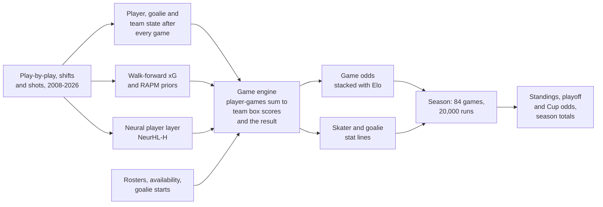

# NeurHL

**NeurHL 1.0** predicts the 2026-27 NHL season with one model at every level:
every skater's game, every game, and every season total. The same engine
produces all three, and they are built to agree. A skater's season goals are
the sum of his projected games, a team's goals are the sum of its skaters',
and its points are the sum of its games. That agreement is checked
([`neurhl/tests/check_neurhl_1_0.py`](neurhl/tests/check_neurhl_1_0.py)). The
predictions were frozen before opening night and are scored in public as the
season is played.

**Browse the projections: [ph05.github.io/neurhl](https://ph05.github.io/neurhl/)**

NeurHL was built under preregistration. Every model, gate and decision rule
was committed before the numbers that tested it existed, and the final tests
ran once on seasons no decision had touched. The record of what worked and
what did not is kept as carefully as the model. [EVIDENCE.md](EVIDENCE.md)
lists every claim with the strength of the evidence behind it, and
[PLAN_NeurHL_1_0.md](PLAN_NeurHL_1_0.md) defines NeurHL 1.0 and how it is
scored.

## How NeurHL 1.0 works



1. **State.** After every game, each skater's, goalie's and team's state is
   updated from what happened in it, on top of every earlier season. Game 50
   of a season sees games 1 to 49.
2. **Game engine.** For two dressed lineups, the engine predicts each
   skater's ice time by strength, shots, individual xG, goals and assists,
   and the goalies' results. Team ice time is conserved exactly, and player
   outputs add up to the team totals. A score-and-time hazard integration
   turns the teams' scoring rates into the result, including overtime and
   shootouts. The final win probability stacks the engine with Elo and the
   neural player layer.
3. **Season.** Every one of the 1,344 games is run through the engine many
   times, each time with lineups and goalie starts sampled from the rosters
   and an availability model. Games played, ice time and every counting stat
   come from those sampled lineups. 20,000 simulated seasons then give the
   standings, playoff odds and Cup odds. The preseason freeze evaluates every
   game with the state as of opening night; the game-day forecasts use every
   game played so far.
4. **Stat sheets.** Hits, blocked shots, giveaways, takeaways, faceoffs and
   penalty minutes come from each player's per-60 rates times the engine's
   ice time, with faceoffs balanced between the two teams in every game.

| Component | Evidence |
|---|---|
| Neural player layer with Elo (NeurHL-H) | **Confirmed**: beats Elo on 10,184 held-out games, 2017-18 to 2025-26 (log loss 0.6650 vs 0.6697; 95% CI of the difference -0.0065 to -0.0031; 8 of 8 seasons) |
| Player-game layer (the engine's starting point for skaters) | **Confirmed**: beats each skater's recent average on ice time, shots, goals and assists (130,092 held-out skater-games) |
| Game engine (NeurHL-G), stacked with Elo and NeurHL-H | Gate evidence: beats Elo on 6,289 games of 2019-2024 (-0.0056, 5 of 5 seasons); level with NeurHL-H alone; player heads beat the player-game layer on all four targets; one calibration check fails (team shots-on-goal intervals too wide) |
| Season simulation | Development evidence: the season-level uncertainty was calibrated for the earlier season layer (80% intervals covered 0.794) and is carried over |
| Walk-forward xG | Beats distance-and-angle in 18 of 18 seasons; top-decile calibration misses its 0.005 target after a 2023 change in shot-location recording |

## The 2026-27 season

- **NeurHL 1.0 freeze:** every game, team and skater, frozen before opening
  night ([neurhl/output/neurhl_1_0/](neurhl/output/neurhl_1_0/)), with its hashes in
  [PLAN_NeurHL_1_0.md](PLAN_NeurHL_1_0.md).
- **Game-day forecasts:** a morning forecast and a pregame forecast about an
  hour before puck drop, committed here before each game, with the lineups
  used and full simulated stat lines ([neurhl/output/live/](neurhl/output/live/)).
- **NeurHL 1.1 layers:** calibrated count distributions for the stat
  sheets, calibrated goal totals and blended skater points. Each is
  preregistered before the games it is judged on, and ships as a dated file
  set scored beside the freeze, which is never edited
  ([PLAN_NeurHL_1_1.md](PLAN_NeurHL_1_1.md)). A walk-forward backtest of the
  season layer on 2019-2024 supports the frozen one (80% intervals cover
  0.82). An exploratory projection of the final standings, updated from each
  night's results, is published in `neurhl/output/live/standings_1_1_2027.csv`.
- **Earlier freeze:** the forecasts frozen on 2026-09-25 by an earlier,
  separately built season layer are unchanged and scored as preregistered
  ([PLAN_NeurHL_LIVE.md](PLAN_NeurHL_LIVE.md)).

## Findings

- **Lineups beat team ratings, and the gain concentrates where lineups
  differ.** The confirmed gain of the neural player layer over Elo is near
  zero when neither team is missing regulars, and largest when one team is
  missing far more than the other (exploratory split of the confirmation
  games).
- **Two very different models reach the same skill.** The game engine,
  which models every skater's deployment and every team's scoring process,
  matches the much simpler neural player layer on win probability. The binding
  constraint is the information available before the game, not model
  capacity.
- **Neural representations of hockey events: a documented null.** A
  transformer trained on 7.6 million play-by-play events learns what kind of
  player someone is (position is linearly decodable at 95%). Pooled over a
  roster, it says almost nothing about how good a team is.
- **The earlier season layer was level with Elo, not better.** On matched
  backtest seasons its points error was slightly worse than the Elo
  baseline's (9.99 vs 9.17, not significant).

## How it was tested

Seasons were assigned to roles before any model was fitted, and the scoring
code refuses to cross those lines.

| Window | Seasons (year ending) | Use |
|---|---|---|
| Development | 2009-2011 | Architecture and calibration choices |
| Tune | 2012-2017 | Gates and model selection |
| Confirmation | 2018-2026 | Scored once per layer, after a freeze commit |
| Live | 2027 | Predictions frozen 2026-09-25, scored as played |

The 2013 season (lockout: 48 games, conference-only) and the 2021 season
(56 games, division-only) are used for training but never for scoring. Every
quantity used to predict a season comes from earlier seasons only, and every
search over configurations was capped and logged in
`neurhl/configs/search_ledger*.csv`.

The preregistration documents are the primary record:
[PLAN_NeurHL.md](PLAN_NeurHL.md) (neural hierarchy and NeurHL-H),
[PLAN_NeurHL2.md](PLAN_NeurHL2.md) (event simulator and season layer),
[PLAN_NeurHL3.md](PLAN_NeurHL3.md) (player and goalie layers) and
[PLAN_NeurHL_LIVE.md](PLAN_NeurHL_LIVE.md) (live scoring). Each amendment is
dated and committed before the run it governs.

## Outputs

| File | Contents |
|---|---|
| `neurhl/output/neurhl_1_0/games_2027.csv` | NeurHL 1.0: every game's home-win probability, four-way outcome, goals, shots, xG and power plays, with Elo and the earlier freeze beside it |
| `neurhl/output/neurhl_1_0/teams_2027.csv` | NeurHL 1.0: team points (mean, 10th, 50th and 90th percentiles), record, goals, shots, xG, playoff, division, Presidents' Trophy and Cup odds |
| `neurhl/output/neurhl_1_0/skaters_2027.csv`, `goalies_2027.csv` | NeurHL 1.0: season totals for every skater and goalie, with intervals for goals, assists and points |
| `neurhl/output/neurhl_1_0/player_games_2027.csv.gz` | NeurHL 1.0: every skater's expected line in every game |
| `neurhl/output/neurhl_1_0/cal_20260929/` | NeurHL 1.1: the 1.0 goal totals with the fitted goal slope (dated set, scored beside 1.0) |
| `neurhl/output/neurhl_1_0/skaters_blend_20260929/` | NeurHL 1.1: skater points blended 50/50 from the engine and the season model (dated set) |
| `neurhl/configs/calibration_1_1.json` | NeurHL 1.1: fitted team-shots dispersion and goal slope, applied to the frozen game-day stat sheets when scored |
| `neurhl/output/games_2027.csv`, `projection_2027.csv`, `player_proj_2027.csv` | The earlier freeze (2026-09-25) |
| `neurhl/output/live/scorecard_2027.json` | Running live scorecard |
| `neurhl/output/live/2027/<date>/` | NeurHL-G game-day forecasts (morning and pregame): home-win probability from NeurHL-G, NeurHL-H and Elo, the lineups used and where they came from, and simulated stat lines for every dressed player |
| `neurhl/output/g_gates.json` | NeurHL-G gate results on 2019-2024 |

## Reproducing

The project needs [uv](https://docs.astral.sh/uv/) and Python 3.12; there is
no environment to install. Raw play-by-play, shift and tensor files are large
and are not in the repository; the fetchers in `neurhl/data/fetch/` rebuild
them.

```sh
# acceptance batteries (NeurHL 1.0, then NeurHL-G)
uv run --no-project --python 3.12 --with numpy --with "pandas<3" --with pyarrow \
  --with scipy --with scikit-learn --with torch --with openpyxl \
  python neurhl/tests/review_tests_neurhl2.py
uv run --no-project --python 3.12 --with numpy --with "pandas<3" --with pyarrow \
  python neurhl/tests/review_tests_neurhl4.py

# NeurHL 1.0 for 2026-27 (every game, team and skater), then its consistency check
uv run --no-project --python 3.12 --with numpy --with "pandas<3" --with pyarrow \
  --with numba --with torch --with scipy --with scikit-learn==1.9.1 --with requests \
  python neurhl/sim/unified_2027.py --rosters-date 2026-09-28
uv run --no-project --python 3.12 --with numpy --with "pandas<3" \
  python neurhl/tests/check_neurhl_1_0.py

# live scorecard
uv run --no-project --python 3.12 --with numpy --with "pandas<3" --with requests \
  python neurhl/eval/score_live_2027.py

# rebuild the site in docs/
uv run --no-project --python 3.12 --with "pandas<3" python neurhl/site/build_site.py
```

Seeds are fixed and recorded. Neural training runs on Apple MPS, which is not
bit-deterministic, so checkpoints are identified by SHA-256 and every reported
number comes from CPU inference over a saved checkpoint.

## Repository

| Path | Contents |
|---|---|
| `neurhl/` | NeurHL: data builders, models, training, evaluation, simulation, tests |
| `neurhl/site/` | Builds the projection site in `docs/` |
| `src/` | The baselines NeurHL is measured against: v1 (Elo with xG) and HOWE (an equal blend of v1 and a ridge model); see [src/README.md](src/README.md) |
| `data/processed/` | Derived team, player and game tables |
| `PLAN_*.md`, `NOTES.md` | Preregistrations and the findings log |

Nothing in `src/` imports NeurHL. The baselines' own history is in `PLAN.md`
and `PLAN_V3.md` through `PLAN_V6.md`.

Commit IDs quoted inside plan documents and records were assigned before the
repository was published; `neurhl/configs/commit_map.csv` maps each one to
its commit here.

## Data

Play-by-play, shifts, rosters, schedules and player statistics come from the
public NHL APIs and game reports. Shot-level and player-season data come from
[MoneyPuck](https://moneypuck.com); only raw recorded fields are used, never
MoneyPuck's model outputs. Team season tables come from
[Natural Stat Trick](https://www.naturalstattrick.com) and
[Hockey-Reference](https://www.hockey-reference.com). All data remain the
property of their sources and are used here for non-commercial research.

## License

Code is released under the MIT License ([LICENSE](LICENSE)). The data terms
above apply to data files.
